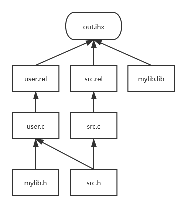

# Template for: STC89C52RC

This is the project template for STC89C52RC based on 8051, building from both source and static library archives are supported

## Common usage

Just open this folder with VSCode

To BUILD your project (Release), go to `Terminal->Run Task->01 Make (release)`, or run `make VER=release` at the terminal

To BUILD your project (Debug), go to `Terminal->Run Task->02 Make (debug)`, or run `make VER=debug` at the terminal

To REMOVE all generated files, go to `Terminal->Run Task->03 Clean`, or run `make clean` at the terminal

To LAUNCH DEBUG with vm8051, run `make debug` at the terminal (run `make VER=debug` first)

To DOWNLOAD the file to your device, connect your device to the computer via USB serial, then run `make install PORT=/dev/YOUR_TTY` at the terminal (run `make VER=release` first)

## Directory structure

`main.c` and other userspace files for the application should be placed under `user/`

Other functional files, which could contain user defined functions, like your `liquid1602.h` and `liquid1602.c` (With the same name) designed for driving a 1602 liquid crystal, should be separately placed under `inc/` and `src/`

Library files archived with `sdar` should be placed under `lib/`, and their include files under `lib/inc/`

`gen/VER/tmp/` holds intermediate files

`gen/VER/` holds output files

## File dependency

## Make commands

Usage:

`make VER=release` or `make VER=debug` to make the .ihx file

`make debug` to launch debug, using vm8051 emulator from https://github.com/lukbettale/VM8051

`make clean` to remove all generated files

`make install PORT=/dev/YOUR_TTY` (Experimental), to burn the .ihx file to your device, using stcflash from https://github.com/laborer/stcflash

Planning to rewrite a downloader using ANSI C to replace stcflash in the future